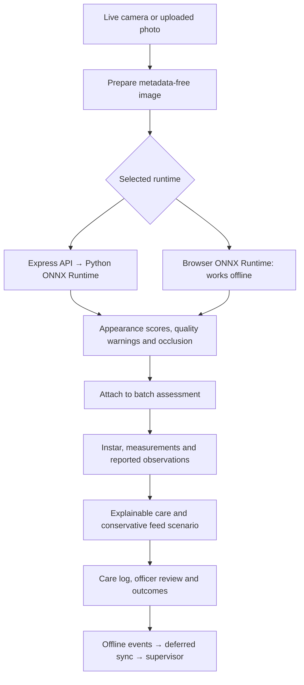

# SilkSense: reuse established models, connect field work

## Foundation we reuse

- [Torchvision MobileNetV3-Small](https://docs.pytorch.org/vision/stable/models/generated/torchvision.models.mobilenet_v3_small.html), with ImageNet pretrained weights and a trained five-class head. No custom convolutional architecture was designed. The backbone is frozen; no end-to-end fine-tuning is claimed.
- ONNX / ONNX Runtime for the same exported network on the Python backend and in browser WebAssembly.
- React, Vite and TypeScript for the application; Express for its API; Dexie/IndexedDB for offline records; SQLite for synchronized events; Zod for validation.
- Existing 4×4 occlusion explanations, rather than an invented attention overlay. Removing each tile and rerunning the model measures its effect on the selected score.

## Integrated field workflow

Runtime selection is explicit. A failed server request does not silently become a local prediction. The prepared pixels are used for inference and the retained photo. Model checksum, execution location, runtime and quality warnings survive assessment serialization and export. Browser weights are checksum-verified before inference; the Python service verifies its loaded file at startup. These fields support traceability, not signed proof against malicious clients.

## What differentiates this application

The useful contribution is the connection between image evidence, uncertain farmer reports, explainable care, repeated observations, and measured outcomes. The application does not need a novel neural architecture to do this well.

- A confident image cannot erase reported deaths or environmental concerns.
- Self-reported fresh feed is still checked against a suspect-feed scenario.
- Low light, overexposure, low detail and insufficient resolution request a retake and withhold a confident appearance decision on the tray-check screen. These are engineering checks, not a general detector of unsupported objects.
- The same network can run offline after installation, with actual browser/backend probability and occlusion parity checks.
- Photos stay on the device after saving. Backend inference processes uploaded image bytes in memory. Structured model evidence can be synchronized without sending the retained image.
- Follow-up scheduling, corrections and observed outcomes preserve a history instead of overwriting the original assessment.

## Acceptance evidence

Build, 34 unit tests and 16 browser/API tests pass. Added cases cover backend result → batch → care guide → export, runtime provenance, offline neural inference and matching explanations, and rejection of confident interpretation for a black image. The existing camera, offline video, review, intervention, harvest and deferred-sync tests remain in place.

## Remaining work that changes credibility

1. Download the relevant AIKosh departmental data through the portal, inspect licence and actual labels/joins, and reserve an independent Andhra Pradesh evaluation before training on it.
2. Obtain reviewed local-language care copy and local SOP approval. AI4Bharat translation/speech is relevant here; no language model integration is currently claimed.
3. Test physical phones and shed captures, including unsupported objects and incorrect user reports. Internal dataset accuracy does not measure these cases.
4. Establish user/farm authorization and hosted HTTPS before shared field deployment. The running demonstration remains localhost.

Further model changes should be driven by those measured failures, not by accumulating architectures or tuning on the held-out test set.

## Telugu and accounts extension — 16 September 2026

The same application now uses i18next/react-i18next and a bundled OFL Noto Sans Telugu font. Authored UI and care copy is translated during rendering; stored measurements, record IDs and user notes are not rewritten. Language changes preserve form state. Mobile layout checks cover the populated Telugu workflow and both-language screen sweeps.

Express-session stores sessions in SQLite; Node scrypt hashes passwords; express-rate-limit throttles login attempts. Account mode checks active accounts and farm membership on each API request. Sync validates entity immutability, parent references and review roles, filters returned rows before pagination, and stores an authenticated submission receipt separately from client records. IndexedDB namespaces isolate account/assignment workspaces. Offline local access has bounded expiry; it is not at-rest encryption or instant remote revocation.

The Caddy and service templates use a same-host loopback reverse proxy. No custom identity protocol, neural architecture or distributed synchronization framework was introduced. See DEPLOYMENT.md for operational limits and activation steps.
